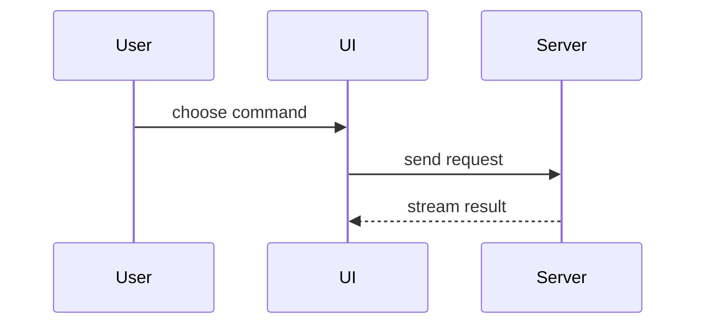

# Quick views (inline, for the user)

Use when the reader is the user mid-task. Pick the smallest view that makes the
key point clear; skip the preamble; keep prose brief.


- Show logic or an algorithm as pseudocode:

```text
on(save)
  if content is unchanged
    return cached result
  write new content
  return fresh result
```

- Show runtime control flow as a call tree:

```text
submitForm
  createSession
    persistPrompt
    launchAgent
  navigateToSession
```

- Show UI structure as a component tree, including state and module boundaries that matter:

```tsx
<SessionPage> (apps/example/src/routes/session.tsx)
  useSessionEvents()
  <SessionToolbar>
    <RunCommandButton> (packages/ui)
```

- Show file responsibility or a broad refactor as a shallow file tree:

```text
src/
├── commands/       # parses user actions
├── sessions/       # owns session state
└── transport/      # sends API requests
```

- Show component interaction, control flow, or data flow with Mermaid:



- Use `diff` when the point is what changes and the surrounding shape already exists.
  Match the diff shape to the topic.

For a component change:

```diff
 <SessionPage>
   useSessionEvents()
   <SessionToolbar>
+    <RunCommandButton />
   <SessionTimeline>
+    <CommandResultCard />
```

For a file-layout change:

```diff
 src/
 ├── commands/
+│   └── explain.ts       # expands the command
 ├── sessions/
-└── transport.ts
+└── transport/
+    ├── client.ts
+    └── stream.ts
```

For a call-tree or call-stack change:

```diff
 submitForm
   createSession
     persistPrompt
+    expandCommand
     launchAgent
-  navigateToSession
+  navigateToSession
+    subscribeToEvents
```

For a state or control-flow change:

```diff
 on(save)
-  write content
+  if content is unchanged
+    return cached result
+  write new content
+  invalidate cache
```

- Show the whole block when most of it is new, when omitted context would hide
  ownership or order, or when the user needs a copyable target shape:

```ts
function expandCommand(command: string): string {
  const name = command.slice(1)
  return `run the ${name} command`
}
```

- For a visual UI, layout, state comparison, or concept too dense for Mermaid, write
  one focused HTML file — a diagram, an infographic, or a short slide deck, whichever
  fits the point. Match the product's colors, type, spacing, and components; use real
  labels and data; support desktop and mobile. Save it in the current workspace as
  `explain/explain-<description>.html` (create `explain/` if needed), tell the user the
  path, and open it with the platform's default opener:

```bash
start "" explain/explain-<description>.html   # Windows (cmd or Git Bash)
open explain/explain-<description>.html       # macOS
xdg-open explain/explain-<description>.html   # Linux
```

## Guidance

Place each visual next to the short text it supports. Keep only the calls, files,
props, states, and boundaries needed to answer the user's current question, or the
options needed to resolve the current discussion point.

You may use one of these views or several; you will rarely need all of them. Use
judgement and don't overwhelm the user.

If the visual grows past one focused point, or someone other than the user will
read it, switch to the explainer-page workflow in `SKILL.md`.
